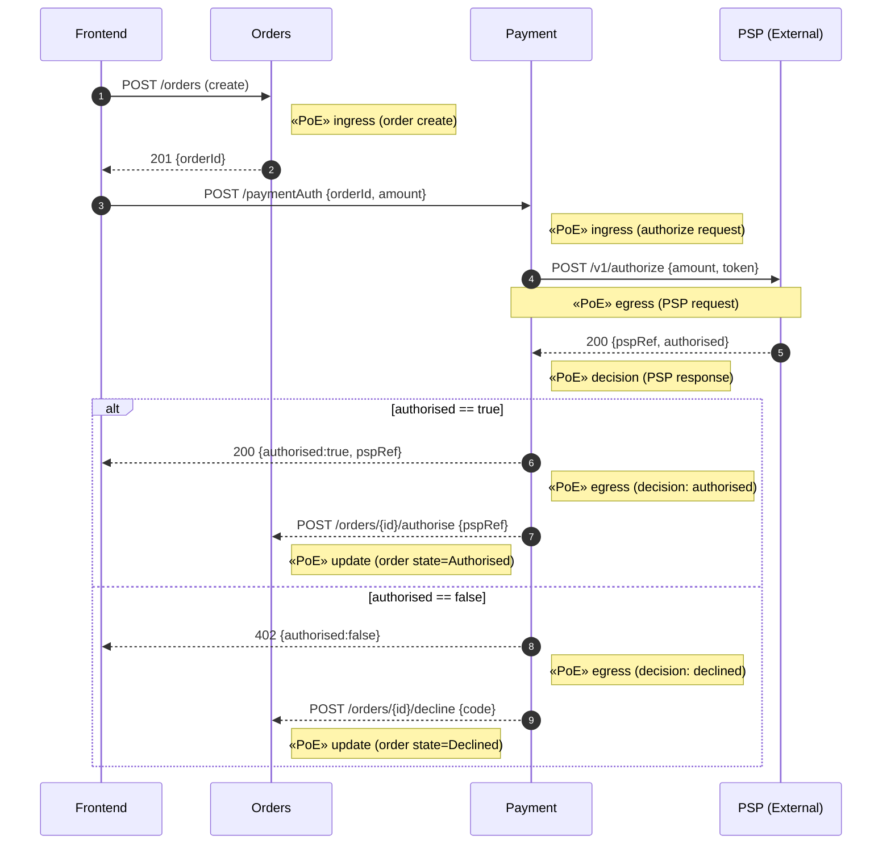

# Payment Service — PoE for Checkout: Payment Authorization

This diagram shows the inter-service flow for the authorization sub-workflow and where Proofs of Execution (PoE) are emitted. The `payment` service emits PoEs at the ingress (request received), PSP egress/ingress (simulated PSP call), and decision (response) points.

- PoE emission in code
  - Ingress (request): `src/payment/endpoints.go` emits PoE before calling `Service.Authorise`.
  - PSP egress/ingress: `src/payment/endpoints.go` emits PoE around the simulated PSP call (`psp_request` and `psp_response` stages).
  - Decision (response): `src/payment/endpoints.go` emits PoE after the authorization decision.
  - Sidecar ingest URL: `SIDECAR_INGEST_URL` (default `http://127.0.0.1:8089/prove`).
